# TIC - Banco de Dados

Repositório para armazenamento de estudos referente ao curso de Banco de Dados, com MySQL e PostgreSQL, ministrado através do projeto [Residência em TIC 12](https://tic-hub.irede.org.br/).

## 📖 Sumário
<!-- - [Conteúdo;](#-conteúdo-estudado) -->
- [Ferramentas e tecnologias utilizadas;](#-ferramentas-e-tecnologias-utilizadas)
- [Capítulo 1 - Introducao aos Bancos de Dados;](#capítulo-1-introdução-aos-bancos-de-dados)
- [Capítulo 2 - Modelagem de Dados;](#capítulo-2-modelagem-de-dados)
- [Capítulo 3 - Uso de SGBD;](#capítulo-3-uso-de-sgbd)
- [Capítulo 4 - Relacionamentos e Junções;](#capítulo-4-relacionamentos-e-junções)
<!-- - [Licença](#capítulo-4-relacionamentos-e-junções)
- [Autor](#capítulo-4-relacionamentos-e-junções)

## 📘 Conteúdo estudado:
- SQL;
- MySQL Workbench;
- PG Admin 4 (PostgreSQL);
- brModelo; -->

## 🔧💻 Ferramentas e tecnologias utilizadas:
- SQL;
- MySQL Workbench;
- PG Admin 4 (PostgreSQL);
- brModelo;

## Capítulo 1: Introdução aos Bancos de Dados

**Objetivos de aprendizagem:** Compreender o que é um banco de dados e sua importância, conhecer os principais conceitos e terminologias relacionados a bancos de dados.

## Capítulo 2: Modelagem de Dados

**Objetivos de aprendizagem:** Aprender a explorar como os dados são organizados e gerenciados em bancos de dados, compreender sobre entidades, atributos e relacionamentos de maneira prática e interativa usando o brModelo.

### Capítulo 2.1: Modelagem de Dados

#### 1. Entidade forte x Entidade fraca:
- `Entidade forte:` não depende de uma entidade e contém uma chave primária.
- `Entidade fraca:` depende de uma entidade para existir e não contém *chaves parciais (não foi explicado o que é)*

**Representação de entidade forte e fraca:**
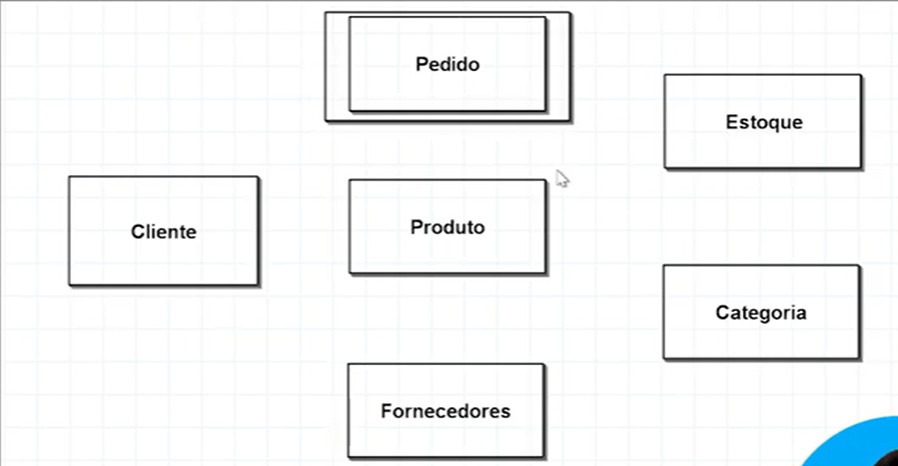

*A forma como `pedido` está representado mostra uma entidade fraca.*

#### 2. Graus de Relacionamentos:

> Representa a indicação de quantas entidades estão envolvidas em um relacionamento.

Os graus de relacionamentos se dividem em alguns tipos:

- `Binário`: indica que teremos duas entidades envolvidas em um relacionamento.
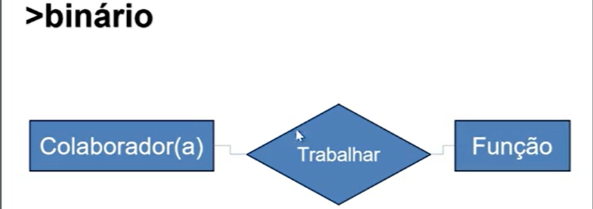

- `Ternário`: indica que teremos três entidades envolvidas em um relacionamento.

- `N-nário`: indica que teremos quatro, em diante, entidades envolvidas em um relacionamento.
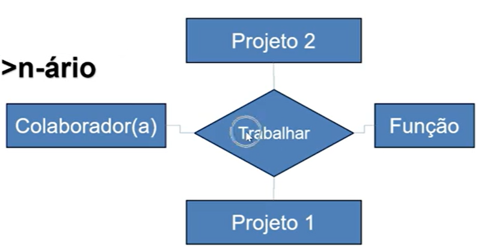

#### 3. Relacionamentos na prática
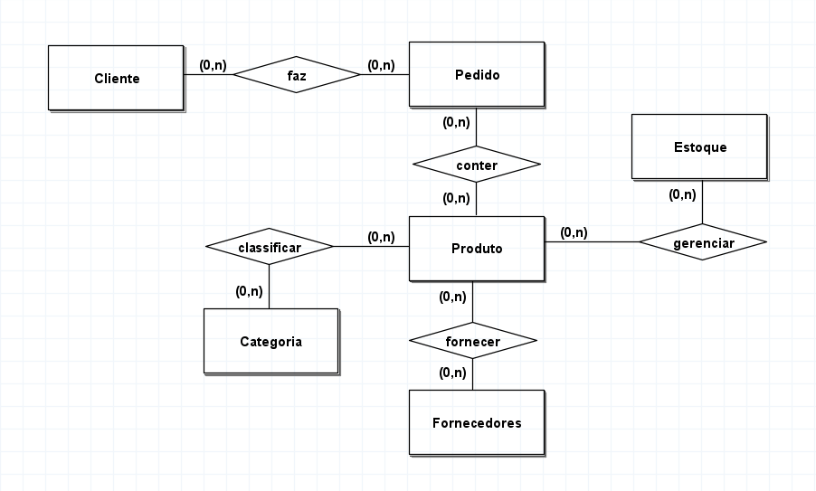

#### 4. Cardinalidade

> Indica quantos objetos (instâncias) de uma entidade, podem se relacionar com outra entidade, através de um relacionamento.

Os tipos de cardinalidade são:

- `(0, n)`: indica que uma entidade pode se relacionar com zero ou várias ocorrências de outra entidade.

- `(1, 1)`: quando uma entidade pode se comunicar apenas com um único objeto de outra entidade.

- `(1, n)`: quando uma entidade pode se comunicar com diversos objetos de outra entidade.

- `(n, n)`: quando uma entidade pode se comunicar com diversos objetos de outra entidade e vice versa.


>> ***Um objeto da minha entidade A, pode ter relacionamento, no mínimo, com quantos objetos da minha entidade B? E no máximo?***

#### 5. Entidade associativa

É quando teremos um relacionamento entre as cardinalidades (n, n). Exemplo:
> Em nossas entidades Pedido e Produto há um relacionamento com cardinalidade (n, n)

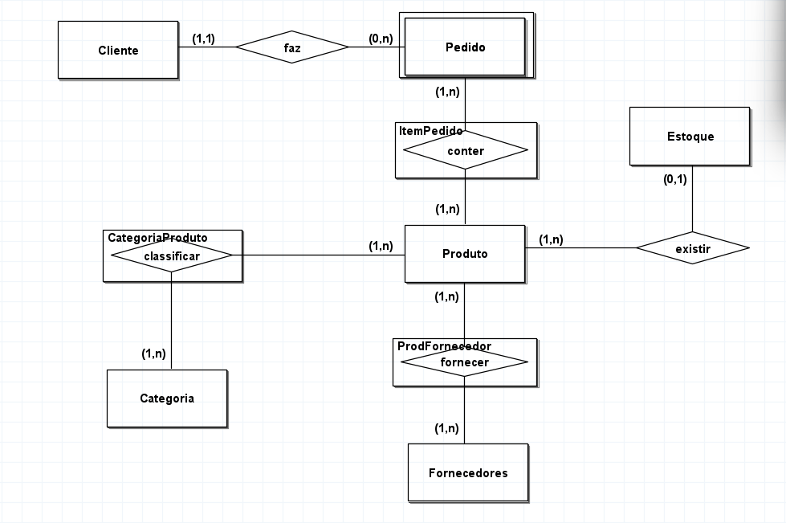

#### 6. Atributos

São as características da entidade. Exemplo:


*Podemos ter atributos compostos, multivalorados e determinante, como `endereço`, `telefone` e `cpf`*

#### 7. Especialização e Generalização

Especialização seria a divisão na entidade mais genérica. Como assim? Podemos usar
como exemplo a entidade `Cliente`, que, a partir dela, conseguimos criar outras entidades, ou seja, subdividir,
criar entidades filhas desta mais genérica. Um caso comum é que cliente pode ser pessoa física ou jurídica.

O que diferencia um tipo de cliente do outro, pertimindo que identifiquemos a possibilidade de entidades filhas?
Nesse caso, sabemos que cada tipo de cliente possui uma identificação específica: CPF E CNPJ.

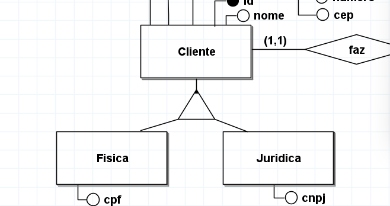

Generalização se aplica no caso de impossibilidade de especialização. Usando nosso atributo `telefone` e
o transformando em uma entidade, a fim de exemplificar, sabemos que podemos ter diversos tipos de telefones, 
como residencial e comercial. Apesar de poder ter essa definição, não podemos - e nem seria uma boa pratica -
fazer a especialização porque, mesmo que mude o tipo, todo telefone contém os mesmos atributos: `ddd` e `numero`.

Neste caso, o mais indicado seria o instanciamento de um novo atributo chamado `tipo`:

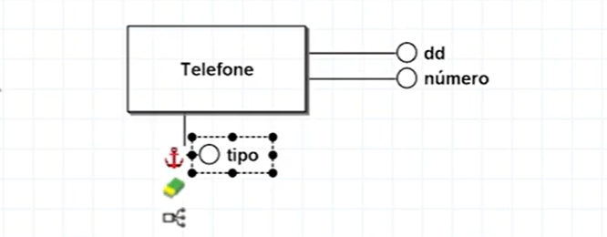

### Resumo até este ponto

Vimos até o momento sobre modelagem de dados: entendemos sobre seu conceito, importância e fases.

Iniciamos Mini mundo, que é um projeto de estudo de casos para Banco de Dados, até chegarmos a compreensão
de modelo conceitual, utilizando o Diagrama de Entidade-Relacionamento (DER).

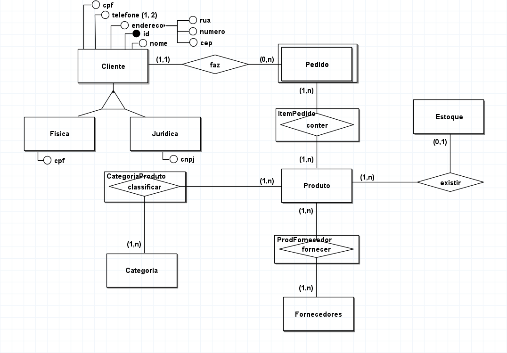

### Capítulo 2.2:  Modelo Entidade-Relacionamento

#### 1. Nornalização

Um conjunto de regras para que possamos construir tabelas bem projetadas e que não tenhamos redundâncias de dados.
Para isso, devemos evitar algumas anomalias, como de inclusão, modificação e exclusão.

#### 2. 1ª Forma Normal (FN)

Para uma tabela estar na 1FN deve ter apenas atributos atômicos, ou seja, não pode conter dados repetidos em sua estrututra.

#### 3. 2ª Forma Normal (FN)

Para acontecer, obrigatoriamente deve atender a 1FN, além de não possuir dependência parcial da primary key (PK), ou seja:
atributo não-chave não pode se referir apenas a uma parte da PK.

#### 4. 3ª Forma Normal (FN)

Deve atender as duas FNs anteriores e não pode ter dependência transitivas, ou seja, atributos não devem depender
de atributos que não sejam PK.

#### 5. Modelo lógico - tabela e campos

O modelo lógico seria a representação detalhada que descreve a estrutura de dados e os seus relacionamentos, servindo
como um passo a passo intermediário entre o modelo conceitual e o físico. Ele transforma os conceitos gerais do modelo 
conceitual em uma estrutura mais técnica, definindo atributos, tipos de dados, chaves primárias e estrangeiras, e 
relações de cardinalidade, tornando o projeto pronto para implementação. 

#### 6. Modelo lógico - multivalorado e composto

Para representar atributos multivalores e compostos no modelo lógico, devemos transforma-los em uma nova tabela.

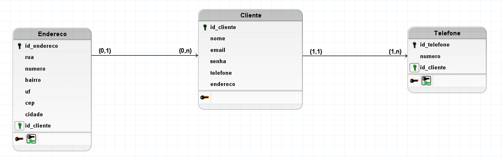

#### 7. Modelo lógico - Entidade fraca

Usando a entidade fraca de nosso exemplo, `Produto`, temos a seguinte representação lógica:

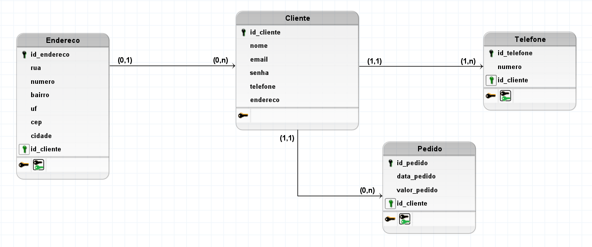

*No brModelo, para a representação lógica, não há uma diferenciação gráfica entre entidades fortes e fracas.*

#### 8. Modelo lógico - Entidade associativa

No modelo lógico, uma entidade associativa também será transformada de uma tabela que conterá como chave estrangeiras as
chaves primárias das tabelas na qual faz associação.

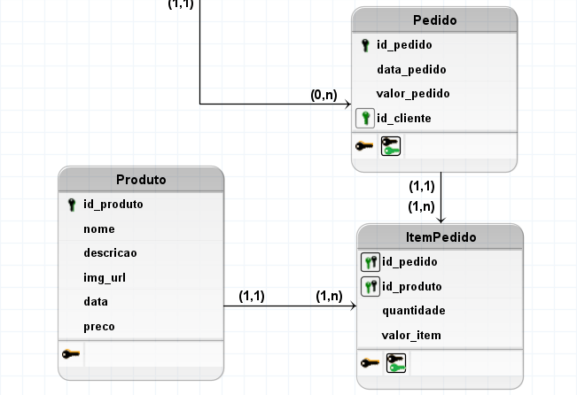

#### 9. Modelo lógico - Especialização

No modelo lógico, representamos a especialização da seguinte maneira:

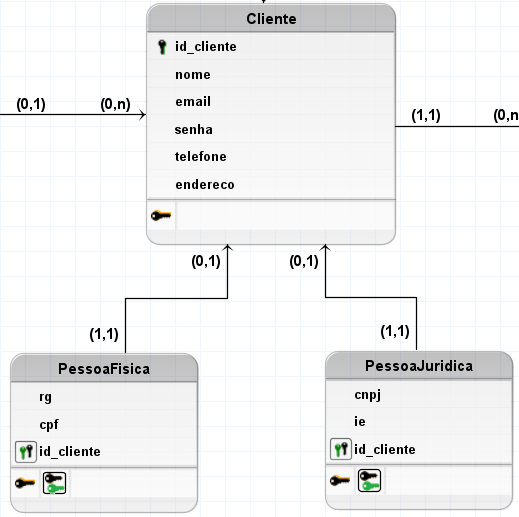

#### 10. Modelo lógico - Projeto ordem de serviço

Exercício de criação do zero de um modelo lógico referente ao banco de dados de um projeto para armazenagem
de ordem de serviços, baseado nas regras de negócio da empresa.


## Capítulo 3: Uso de SGBD

**Objetivos de aprendizagem:** Conhecer a linguagem SQL para aprender a criar, alterar e excluir objetos do banco de dados utilizando comandos DDL (Data Definition Language), assim como, consultas, inserções, atualizações e exclusões em um banco de dados utilizando comandos DML (Data Manipulation Language), tudo isso com Sistemas Gerenciadores de Bancos de Dados (SGBD), utilizando exemplos e cenários reais.

### Capítulo 3.1: DDL

#### 1. Tipos

**Tipos inteiros:**

| Tipo | Bytes | Menor valor | Unsigned | Maior valor | Unsigned |
|-------|-------|-------|-------|-------|-------|
| Tinyint | 1 | -128 | 0 | 127 | 255 |
| Smallint | 2 | -32768 | 0 | 32767 | 65535 |
| Mediumint | 3 | -8388608 | 0 | 83888607 | 16777215 |
| Int | 4 | -21477483648 | 0 | 2147483647 | 4294967295 |
| Bigint | 8 | -2xE63 | 0 | 2xE63-1 | 2xE64 |

**Tipos flutuantes:**

> Exemplo: se declararmos um campo FLOAT(7, 4) se incluimos o numero `999,00009` o valor armazenado será `999,0001`.

| Tipo | Bytes |
|-------|-------|
| Float | 4 |
| Double | 8 |

**Tipos fixos:**

> Especificamos o número de dígitos e o número de casas decimais. Exemplo: se declararmos um campo DECIMAL(5, 2) poderemos armazenar valores somente entre `-999,99` e `999,99`.

| Tipo | Dígitos |
|-------|-------|
| Decimal | 65 |
| Numeric | 65 |

**BIT:**

> Tamanho: Até 64 Bits. Exemplo: `BIT(1)` - Pode ser 1 ou 0; `BIT(2)` - Pode ser 01, 10, 00, 11

| Tipo | Valor |
|-------|-------|
| BIT | 1 ou 0 |

**Tipos de data e hora:**

| Tipo | Valor |
|-------|-------|
| Date | 1000-01-01 até 9999-12-31 |
| Datetime | 1000-01-01 00:00:00 até até 9999-12-31 23:59:59 |
| Timestamp | 1970-01-01 00:00:01 UTC até 2038-01-19 UTC |
| Time | -838:59:59 até 839:59:59 |
| Year | 1901 até 2155 |

**Tipos textuais:**

| Tipo | Suporte | Tamanho (Bytes por Caractere) | Tipo de Comprimento | Observação |
|---|---|---|---|---|
| **CHAR(N)** | Não-Unicode | 1 | Fixo | Ocupa N bytes (preenchido com espaços). Use para dados de tamanho consistente (ex: `CHAR(2)` para UF). |
| **VARCHAR(N)** | Não-Unicode | 1 (+ 1 ou 2 para *overhead*) | Variável | Ocupa apenas o espaço necessário. Mais econômico em espaço para textos curtos de tamanho variável. |
| **NCHAR(N)** | **Unicode** | 2 | Fixo | Duplica o espaço (2 bytes por caractere), mas garante suporte a caracteres internacionais. |
| **NVARCHAR(N)** | **Unicode** | 2 (+ 1 ou 2 para *overhead*) | Variável | **Recomendado para dados internacionais** (múltiplos idiomas, emojis). Ocupa apenas o necessário. |
| **TINYTEXT** | Não-Unicode/Charset | Variável | Variável (Máx. $255$ B) | Para textos curtos (Máx. 255 bytes). |
| **TEXT** | Não-Unicode/Charset | Variável | Variável (Máx. $64$ KB) | Para textos longos. (Máx. 65.535 bytes). |
| **MEDIUMTEXT** | Não-Unicode/Charset | Variável | Variável (Máx. $16$ MB) | Para textos muito longos. (Máx. $16,7$ milhões de bytes). |
| **LONGTEXT** | Não-Unicode/Charset | Variável | Variável (Máx. $4$ GB) | Para textos de tamanho extremo. |
| **ENUM** | Variável | 1 ou 2 | Fixo | Armazena o **índice numérico** de uma *string* pré-definida. Otimiza o uso de espaço. |
| **TINYBLOB** | Binário puro | 1 | Variável (Máx. $255$ B) | Binário. Usado para dados binários curtos (ex: *hashes*). |
| **BLOB** | Binário puro | 1 | Variável (Máx. $64$ KB) | Binário. Para imagens e arquivos de médio porte. |
| **LONGBLOB** | Binário puro | 1 | Variável (Máx. $4$ GB) | Binário. Para arquivos de grande porte (vídeos, documentos). |

***Observação:*** Em sistemas como **SQL Server**, os tipos `TEXT` e `BLOB` são obsoletos e substituídos por `VARCHAR(MAX)` e `VARBINARY(MAX)`. No **MySQL**, a diferença entre `VARCHAR` e `NVARCHAR` é controlada pela Codificação de Caracteres (Charset) da tabela/coluna.

#### 2. MySQL Workbench

Familiarização e utilização de ambiente de gerenciamento de banco de dados MySQL.

> 🗃️ [Documentação do MySQL](https://dev.mysql.com/doc/)

#### 3. Criação e exclusão de banco de dados

Por padrão, os comandos para criação de banco de dados são escritos em *UPPERCASE (letras maiúsculas)*, exceto nomes
dos bancos, tabelas e atributos.

Referente a nomeação, além de ser em *LOWERCASE (letras minúsculas)*, não usamos números em seu início e também não 
pode conter espaços em palavras. O ideal é utilizar padrões como o `camelCase` e `snake_case`.

**Exemplo de criação de banco de dados:**

```SQL
-- Loja é o nome do nosso banco de dados
CREATE DATABASE IF NOT EXISTS loja

-- Define o padrão de caracteres como pt-BR
DEFAULT CHARACTER SET utf8mb4

-- Define que a coleção de dados seja em pt-BR
DEFAULT COLLATE utf8md4_unicode_ci;
```

**Exemplo de exclusão de banco de dados:**

```SQL
-- Loja é o nome do nosso banco de dados
DROP DATABASE IF EXISTS loja;
```

#### 4. Criação de banco de dados com assistente

Dentro do MySQL Workbench, siga os passos abaixo:

*Clique no botão para criar um novo schema:*

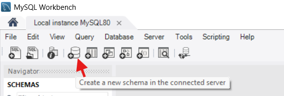

*Após abrir essa janela, defina as configurações que deseja para o banco de dados (como nome e padrão de caracteres):*

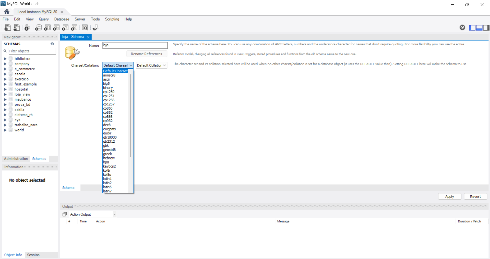

*Clicando em `Apply` na tela anterior, aparecerá esta próxima mostrando os comandos aplicados e aguardando confirmação de criação de banco de dados:*


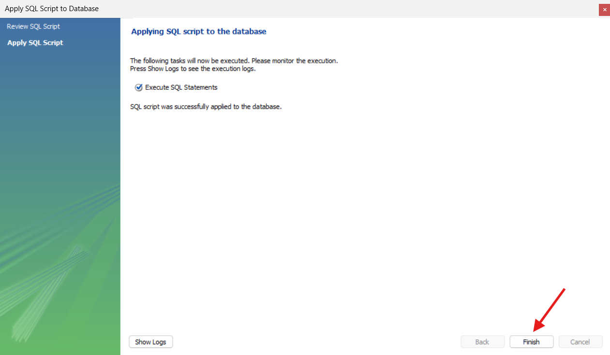

*Mensagem de confirmação de criação de banco de dados:*

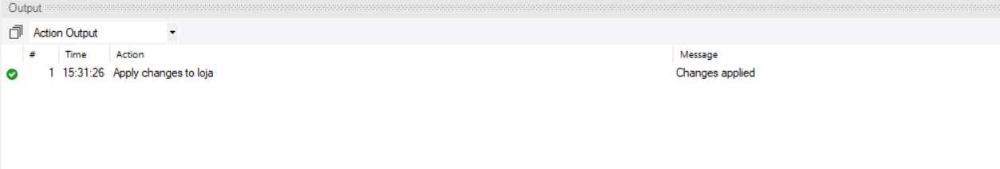

#### 5. Mysql_linha_comando

Exemplo de utilização de banco de dados através do terminal Windows:

```terminal
Microsoft Windows [versão 10.0.26100.6899]
(c) Microsoft Corporation. Todos os direitos reservados.

C:\Users\user>cd\

C:\>"Program Files"
'"Program Files"' não é reconhecido como um comando interno
ou externo, um programa operável ou um arquivo em lotes.

C:\>"Arquivos de Programas"
'"Arquivos de Programas"' não é reconhecido como um comando interno
ou externo, um programa operável ou um arquivo em lotes.

C:\>cd "Program Files"

C:\Program Files>cd MySQL

C:\Program Files\MySQL>cd "MySQL Server 8.0"

C:\Program Files\MySQL\MySQL Server 8.0>cd bin

C:\Program Files\MySQL\MySQL Server 8.0\bin>mysql -h localhost -u root -p
Enter password: ******
Welcome to the MySQL monitor.  Commands end with ; or \g.
Your MySQL connection id is 14
Server version: 8.0.42 MySQL Community Server - GPL

Copyright (c) 2000, 2025, Oracle and/or its affiliates.

Oracle is a registered trademark of Oracle Corporation and/or its
affiliates. Other names may be trademarks of their respective
owners.

Type 'help;' or '\h' for help. Type '\c' to clear the current input statement.

mysql> show databases;
+--------------------+
| Database           |
+--------------------+
| biblioteca         |
| company            |
| e_commerce         |
| escola             |
| exercicio          |
| first_example      |
| hospital           |
| information_schema |
| loja_view          |
| meubanco           |
| mysql              |
| performance_schema |
| prova_bd           |
| sakila             |
| sistema_rh         |
| sys                |
| trabalho_nara      |
| world              |
+--------------------+
18 rows in set (0.07 sec)
```

#### 6. Criação e exclusão de tabelas

Exemplo de criação e exclusão de tabelas:

```SQL
-- CRIAÇÃO DE TABELA

-- Entramos em nosso database criado
USE loja;

CREATE TABLE Cliente(
	id INT AUTO_INCREMENT PRIMARY KEY,
    nome VARCHAR(60),
    cpf CHAR(11),
    altura DECIMAL(3,2),
    idade INT,
    credito FLOAT,
    ativo BIT(1),
    data_criacao DATETIME, 
    data_atualizacao DATETIME,
    cidade VARCHAR(20),
    rua VARCHAR(20),
    numero INT,
    cep CHAR(8),
    nacionalidade VARCHAR(20) DEFAULT 'Brasil'
);

-- EXCLUSÃO DE TABELA
DROP TABLE Cliente;
```

#### 7. Criação de tabelas com assistente:

Dentro do MySQL Workbench, siga os passos abaixo:

*Clique no botão para criar uma nova tabela:*


*Após abrir essa janela, defina as configurações que deseja para a tabela, como nome e atributos, clicando onde a seta mostra. Nos botões de check, na linha onde está definindo o atributo, pode definir se ele será `primary key` ou `not null`, por exemplo:*

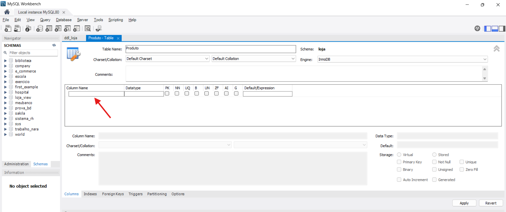

*Clique em `Apply` para criação de tabela:*

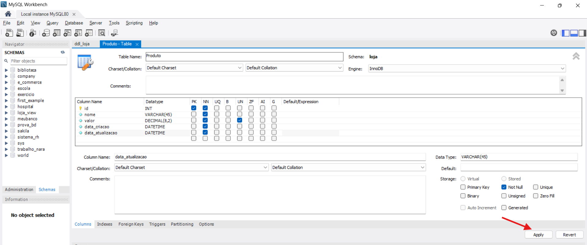

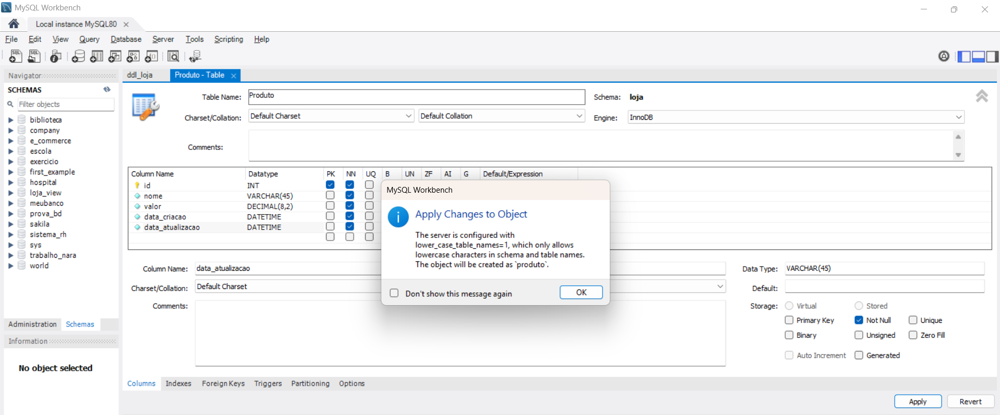

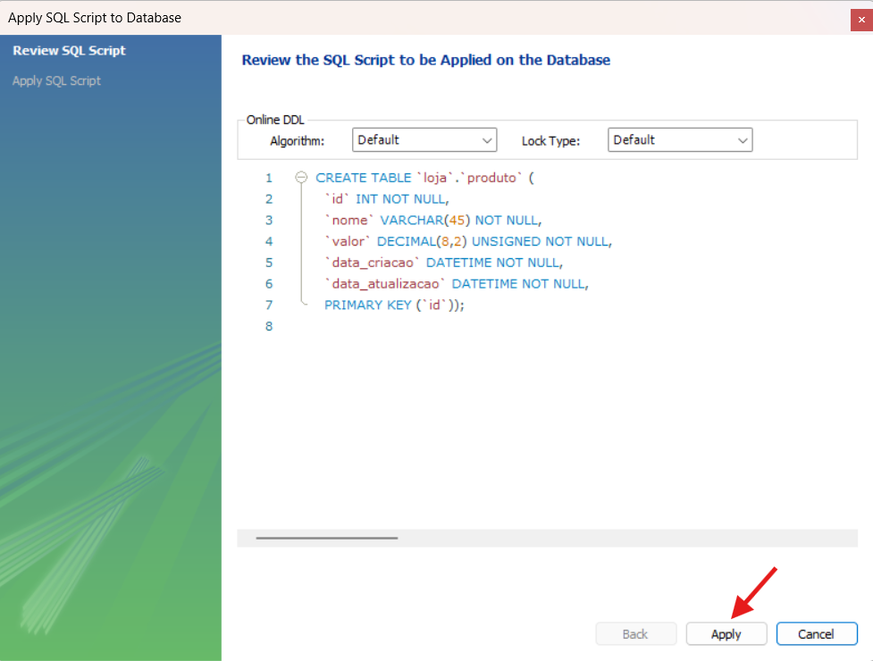

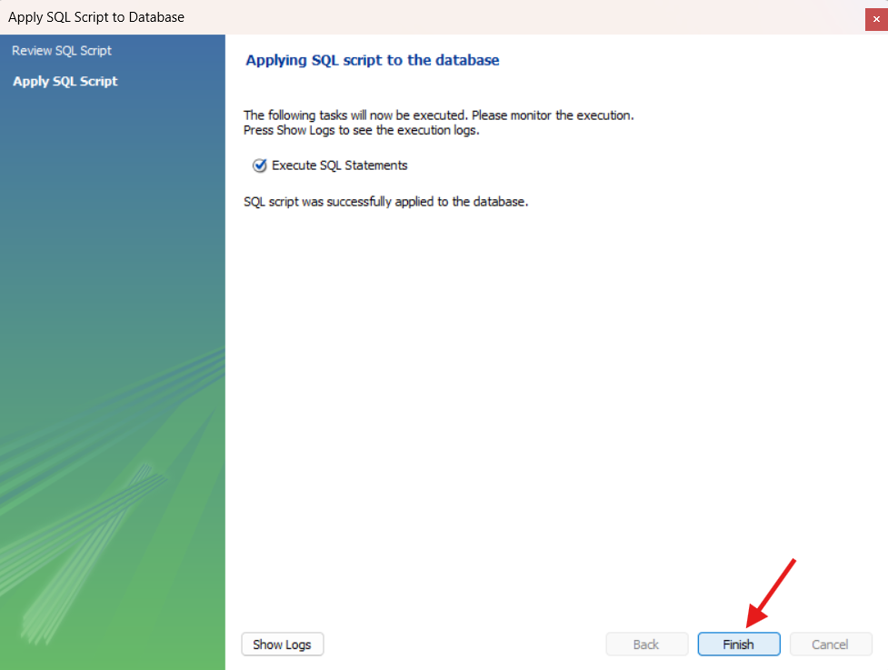

*Mensagem de confirmação de criação de banco de dados:*

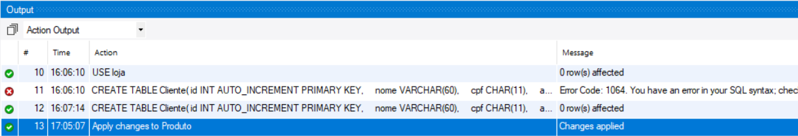

#### 8. Alterando tabelas

Exemplo de alteração de tabelas:

```SQL
-- Entrando em nosso banco de dados
USE loja;

-- Criação de tabela
CREATE TABLE funcionarios(
    salario FLOAT,
    data_de_nascimento DATE
);

-- Adicionando coluna
ALTER TABLE funcionarios ADD COLUMN profissao VARCHAR(30);

-- Adicionando coluna com constraint
ALTER TABLE funcionarios ADD COLUMN nome VARCHAR(30) NOT NULL UNIQUE FIRST;

-- Deletando coluna
ALTER TABLE funcionarios DROP COLUMN profissao;

-- Adicionando coluna após outro campo
ALTER TABLE funcionarios ADD COLUMN profissao VARCHAR(30) AFTER nome;

-- Adicionando coluna com primary key (chave primária)
ALTER TABLE funcionarios ADD COLUMN id INT AUTO_INCREMENT;
ALTER TABLE funcionarios ADD PRIMARY KEY(id);

-- Descrição de tabela (onde podemos visualizar todas suas colunas)
DESC funcionarios;
-- Também pode ser DESCRIBE <nome_da_tabela>;

-- Modificando coluna
ALTER TABLE funcionarios MODIFY COLUMN id INT NOT NULL FIRST;
-- FIRST coloca id como primeiro campo da tabela

-- Modificando nome da coluna
ALTER TABLE funcionarios CHANGE COLUMN profissao cargo VARCHAR(20) NOT NULL;

-- Alterar nome da tabela
ALTER TABLE funcionarios RENAME TO colaboradores;

-- DELETANDO A TABELA
DROP TABLE colaboradores;
```

#### 9. 1 para 1 - SQL

Neste trecho iremos aprender como criar o relacionamento 1 para 1 em SQL seguindo o modelo conceitual abaixo:

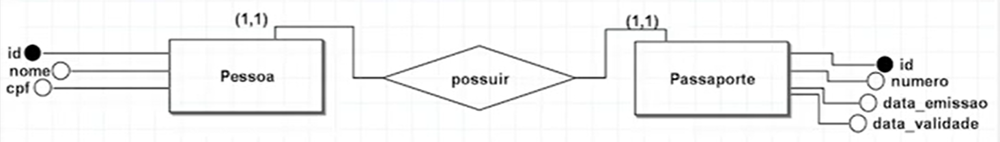

```SQL
CREATE TABLE Pessoa(
    id INT AUTO_INCREMENT PRIMARY KEY,
    nome VARCHAR(30) NOT NULL,
    cpf CHAR(11) NOT NULL UNIQUE
);


CREATE TABLE Passaporte(
    id INT AUTO_INCREMENT PRIMARY KEY,
    numero CHAR(30) NOT NULL UNIQUE,
    id_pessoa INT NOT NULL UNIQUE,
    data_emissao DATETIME NOT NULL,
    data_validade DATE NOT NULL,
    CONSTRAINT fk_pessoa_passaporte FOREIGN KEY(id_pessoa) REFERENCES Pessoa(id)
);
```

#### 10. 1 para N - SQL

Neste trecho iremos aprender como criar o relacionamento 1 para muitos (N) em SQL seguindo o modelo conceitual abaixo:

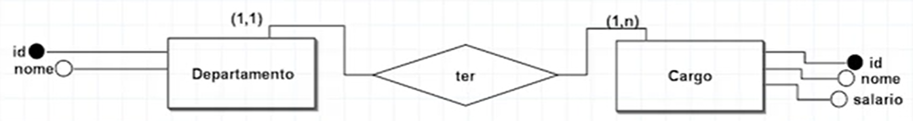

```SQL
CREATE TABLE Departamento(
    id INT AUTO_INCREMENT PRIMARY KEY,
    nome VARCHAR(30) NOT NULL,
);

CREATE TABLE Cargo(
    id INT AUTO_INCREMENT PRIMARY KEY,
    nome VARCHAR(30) NOT NULL,
    salario DECIMAL(10, 2),
    id_departamento INT NOT NULL UNIQUE,
    CONSTRAINT fk_departamento_cargo FOREIGN KEY(id_pessoa) REFERENCES Pessoa(id)
);
```

#### 11. N para N - SQL

Neste trecho iremos aprender como criar o relacionamento muitos para muitos (N, N) em SQL seguindo o modelo conceitual abaixo:

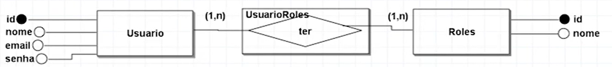

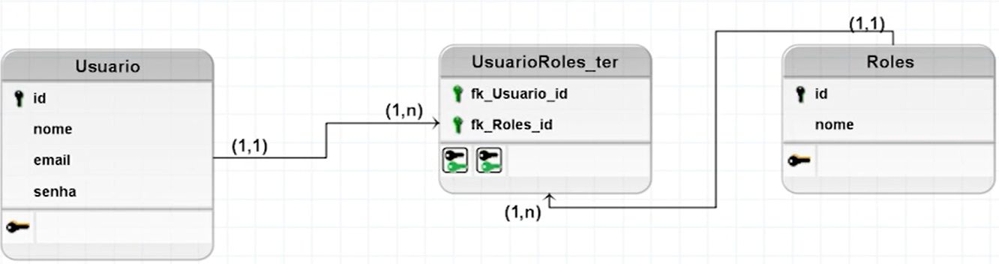

```SQL
CREATE TABLE Usuario(
    id INT AUTO_INCREMENT PRIMARY KEY,
    nome VARCHAR(30) NOT NULL,
    email VARCHAR(50) NOT NULL,
    senha VARCHAR(255) NOT NULL,
);

CREATE TABLE Roles(
    id INT AUTO_INCREMENT PRIMARY KEY,
    nome VARCHAR(30) NOT NULL,
);

CREATE TABLE Usuario_roles(
    id_usuario INT NOT NULL UNIQUE,
    id_roles INT NOT NULL UNIQUE,
    PRIMARY KEY(id_usuario, id_roles)
    CONSTRAINT fk_usuario_roles FOREIGN KEY(id_usuario) REFERENCES Usuario(id)
    CONSTRAINT fk_roles_usuario FOREIGN KEY(id_roles) REFERENCES Roles(id)
);
```

### Capítulo 3.2: DML e DQL

#### 1. Definição

- DML: Data Manipulation Language (Linguagem de Manipulação de dados) são os comandos que interagem com os dados dentro das tabelas. São exemplo de comandos DML:

    - INSERT;
    - UPDATE;
    - DELETE;

- DQL: Data Query Language (Linguagem de Consulta de dados) são os comandos que consultam os dados dentro das tabelas. São exemplo de comandos DQL:

    - SELECT;

#### 2. DML - Insert

Exemplo de inserção de dados em tabelas:

> *Utilizamos o insert de acordo com as colunas que possuimos em nossa tabela. Caso não saibamos, pode utilizar `DESC` ou `DESCRIBE` <nome_da_tabela> para verificar nossos campos:*

```SQL
DESCRIBE tbcolaborador;
```

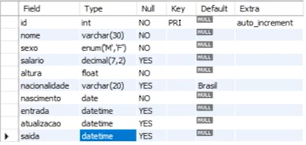

Após a verificação dos campos e suas regras, como seu tipo, valores padrões e seu pode ser nulo ou não, escrevemos nosso comando de inserção da seguinte maneira:

```SQL
INSERT INTO <nome_da_tabela> (<nome_da_coluna>, <nome_da_coluna>, <nome_da_coluna>)
VALUES (<valor>, <valor>, <valor>);
```

Utilizando o exemplo da tabela em nossa imagem, nosso comando seria:

```SQL
INSERT INTO tbcolaborador (nome, sexo, salario, altura, nacionalidade, nascimento, entrada)
VALUES ('Pedro', 'M', 9000.50, 1.65, 'Portugal', '1991-09-29', NOW());
```

⚠️ **Alguns pontos que podem ser detalhados:**
- Nossa 1ª coluna, `id`, não teve valor inserido por nós, porém, como é um atributo 
`auto_increment`, automaticamente recebe um valor sequencial. Em nosso exemplo, caso 
seja a 1ª inserção, receberá de forma automatica um `id` *1*. Caso seja a 2ª inserção, 
recebe um `id` 2, e assim sucessivamente;
- Campos definidos como `VARCHAR`, equivalente a `String` em linguagens de programação, 
devem receber seus valores 'entre aspas' (simples ou duplas);
- Campos definidos com um `DEFAULT`, mesmo que não recebam um valor na inserção,
terão um valor que já foi definido como padrão. Em nosso exemplo, `nacionalidade` teria 
como valor `Brasil`, que foi o `DEFAULT` definido;
- Campos definidos como `ENUM` só podem receber os valores pré estabelecidos. Em nosso exemplo, 
`sexo` é um campo `ENUM('M', 'F')` onde só pode ter atribuído como valor *M* ou *F*;
- Campos com tipo `DATE` são escritos no padrão internacional (ISO 8601): `'AAAA-MM-DD'`;
- Nosso campo `entrada`, definido como `DATETIME`, utilizamos uma função do SQL chamada `NOW()`, onde retorna a data e hora do sistema no momento da inserção;
- Os campos definidos como `NOT NULL` obrigatoriamente devem receber valores;

Podemos realizar inserções individuais ou agrupadas:

```SQL
INSERT INTO tbcolaborador (nome, sexo, salario, altura, nacionalidade, nascimento, entrada)
VALUES 
('Mauro', 'M', 8520.50, 1.85, 'França', '1996-08-19', NOW());
('Marina', 'F', 6533.50, 1.55, 'Brasil', '1998-06-12', NOW());
('Rose', 'f', 10169.50, 1.62, 'Brasil', '2003-11-01', NOW());
```

> ⚠️ O mais indicado é realizar inserções individuais para facilitar resolução em possível ocasionamento de erro.

#### 3. DML - Update

Para efetuar atualização de um dado de nossa tabela, escrevemos nosso comando da seguinte maneira:

```SQL
UPDATE <nome_da_tabela> SET <nome_da_coluna> = <valor> WHERE <nome_coluna_parametro> = <parametro>;
```

Um exemplo pratico do nosso comando seria:

```SQL
UPDATE tbcolaborador SET sexo = 'M' WHERE id = 3;
```

> ⚠️ Para atualizar dados, é imprescindível que nosso comando - *`UPDATE <nome_da_tabela> SET <nome_da_coluna> = <valor>`* - contenha uma cláusula definida com um parâmetro da encontrar local de alteração - *em nosso exemplo estamos alterando o campo `sexo` do colaborador cadastrado com `id 3`: `WHERE id = 3`. Caso não seja definida uma cláusula, TODOS os campos da coluna `sexo` serão alterados para `'M'`.*

Podemos realizar atualizações individuais ou agrupadas:

```SQL
UPDATE tbcolaborador SET atualizacao = NOW(), nacionalidade = 'Brasil' WHERE id = 8;
```

> ⚠️ O mais indicado é realizar atualizações individuais para facilitar resolução em possível ocasionamento de erro.

#### 4. DML - Delete

Para efetuar a exclusão de uma linha de dados de nossa tabela, escrevemos nosso comando da seguinte maneira:

```SQL
DELETE FROM <nome_da_tabela> WHERE <nome_coluna_parametro> = <parametro>;
```

Um exemplo pratico do nosso comando seria:

```SQL
DELETE FROM tbcolaborador WHERE id = 3;
```

> ⚠️ Para deletar dados, é imprescindível que nosso comando - *`DELETE FROM <nome_da_tabela>`* - contenha uma cláusula definida com um parâmetro da encontrar local de alteração - *em nosso exemplo estamos deletando a linha de dados do colaborador cadastrado com `id 3`: `WHERE id = 3`. Caso não seja definida uma cláusula, TODOS os campos de nossa tabela serão `DELETADOS`.*
Também é indicado utilizar como parâmetro uma informação que seja única do colaborador cadastrado, como o id em nossa tabela ou seu CPF.

Podemos realizar exclusões totais na tabela:

```SQL
DELETE FROM tbcolaborador;
```

> ⚠️ Apesar do comando acima excluir todos as linhas da coluna, ele não "reseta" no `id auto_increment`. Se tinhamos 10 usuarios cadastrados antes da exclusão e, posteriormente, fizermos uma nova inserção, este novo usuário terá como id o valor `11`. Para realizar o "reset" do `id` para iniciar com valor `1`, utilizamos:

```SQL
TRUNCATE tbcolaborador;
```

#### 5. Comandos DQL

São comandos utilizados para realizar consultas no banco de dados. Para realizar uma consulta de dados de nossa tabela, escrevemos nosso comando da seguinte maneira:

```SQL
SELECT <nome_da_coluna> FROM <nome_da_tabela>;
```

São exemplos de seu uso:

```SQL
-- CONSULTA TODOS OS DADOS
SELECT * FROM tbcolaborador;

-- CONSULTA COM BETWEEN (E PARÂMETROS) E DIVERSAS COLUNAS
SELECT nome, nascimento WHERE nascimento BETWEEN '2000-01-01' AND '2023-01-01';

-- CONSULTA COM IN (BUSCA MAIS ESPECÍFICA)
SELECT * FROM tbcolaborador WHERE nome IN('João', 'Ana');

-- CONSULTA COM AND E OR
SELECT * FROM tbcolaborador WHERE salario > 3000 AND salario < 5000;
SELECT * FROM tbcolaborador WHERE salario > 3000 OR salario < 5000;

-- CONSULTA COM LIKE
SELECT * FROM tbcolaborador WHERE nome LIKE 'A%';
SELECT * FROM tbcolaborador WHERE nome LIKE '%A';
SELECT * FROM tbcolaborador WHERE nome LIKE '%A%';
```

⚠️ **Alguns pontos que podem ser detalhados:**
- `*` significa `all (todos)`;
- Também podemos utilizar cláusulas para filtrar resultados de nossa busca;
- `LIKE 'A%'` retorna dados onde **iniciam** com a letra *A*;
- `LIKE '%A'` retorna dados onde **terminam** com a letra *A*;
- `LIKE '%A'` retorna dados onde **contenham** a letra *A* em qualquer parte;

#### 6. Agregação

Este trecho tratará de como utilizar funções de agregação com comandos DQL.

```SQL
-- CONSULTA COM COUNT
SELECT COUNT(*) FROM tbcolaborador;
SELECT COUNT(*) FROM tbcolaborador WHERE sexo = 'F';

-- CONSULTA COM MAX
SELECT MAX(salario) FROM tbcolaborador;
SELECT MAX(salario) FROM tbcolaborador WHERE sexo = 'F';

-- CONSULTA COM MIN
SELECT MIN(salario) FROM tbcolaborador;
SELECT MIN(salario) FROM tbcolaborador WHERE sexo = 'F';

-- CONSULTA COM SUM
SELECT SUM(salario) FROM tbcolaborador;
SELECT SUM(salario) FROM tbcolaborador WHERE sexo = 'F';

-- CONSULTA COM AVG
SELECT AVG(salario) FROM tbcolaborador;
SELECT AVG(salario) FROM tbcolaborador WHERE sexo = 'F';
```

⚠️ **Alguns pontos que podem ser detalhados:**
- Também podemos utilizar funções de agragação com cláusulas;
- `COUNT()` conta quantos registros temos;
- `MAX()` retorna o maior valor da coluna;
- `MIN()` retorna o menor valor da coluna;
- `SUM()` retorna a soma de dados;
- `AVG()` retorna a média de dados;

#### 7. Agrupamentos

Este trecho tratará de como distinguir e agrupar dados com comandos DQL.

```SQL
-- DISTINGUINDO POR DISTINCT
SELECT DISTINCT(nacionalidade) FROM tbcolaboradores;

-- AGRUPANDO COM GROUP BY
SELECT sexo FROM tbcolaboradores GROUP BY sexo;

-- AGRUPANDO COM GROUP BY E CONTANDO REGISTROS
SELECT sexo, COUNT(sexo) FROM tbcolaboradores GROUP BY sexo;

-- AGRUPANDO COM GROUP BY E HAVING
SELECT COUNT(id), nacionalidade FROM tbcolaboradores
GROUP BY nacionalidade
HAVING COUNT(id) > 3;

```

⚠️ **Alguns pontos que podem ser detalhados:**
- Também podemos utilizar funções de agrupamento com cláusulas;
- `DISTINCT()` retira uma amostra de cada dado e exibe sem repetir as informações;
- `GROUP BY` agrupa os dados em colunas - *agrupamos sempre pelo campo onde utilizamos no select*;
- `HAVING` cláusula que utiliza um filtro a partir de uma função de agregação;


## Capítulo 4: Relacionamentos e Junções

**Objetivos de aprendizagem:** Compreender o que são relacionamentos e junções (joins) em bancos de dados, conhecer os diferentes tipos de junções e como usá-los para recuperar dados de maneira eficiente, utilizando exemplos e cenários reais.

### Capítulo 4.1: Banco de dados e álgebra relacional

#### 1. Conceito Joins e Outer

- **Joins:** uma tecnica query usada para obter dados provenientes de duas ou mais tabelas, baseado em relacionamentos entre colunas. 

    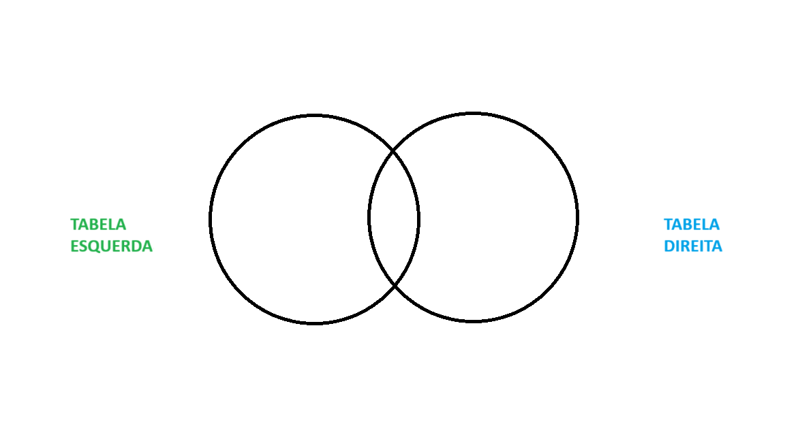

    Possuimos alguns tipos de joins:

    - **Inner join**: retorna dados quando existe uma interseção - *uma correspondência* entre as tabelas:
        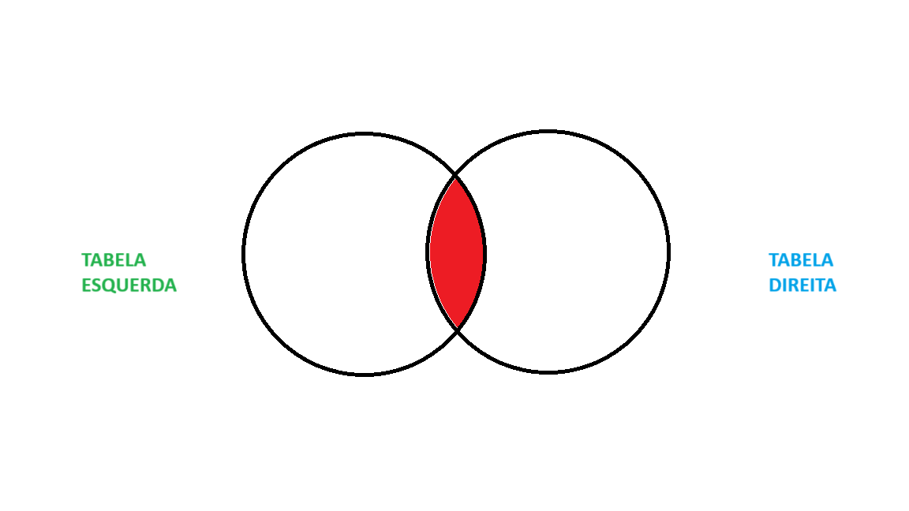

    - **Left join**: também pode ser chamado de outer left join, ou left outer join, retorna todos os dados que estão na tabela esquerda mesmo que não haja correspondência com a tabela direita (caso exista, é trazido com inner):
        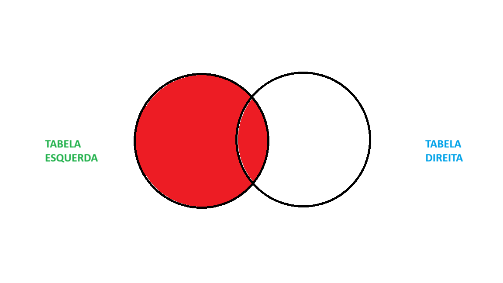

    - **Right join**: também pode ser chamado de outer right join, ou right outer join, retorna todos os dados que estão na tabela direita mesmo que não haja correspondência com a tabela esquerda (caso exista, é trazido com inner):
        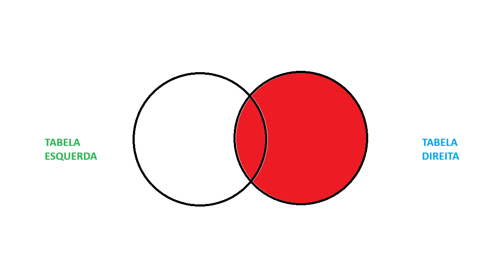

    - **Full join**: Também um outer, combinação de RIGHT e LEFT retornando registros de ambas as tabelas:
        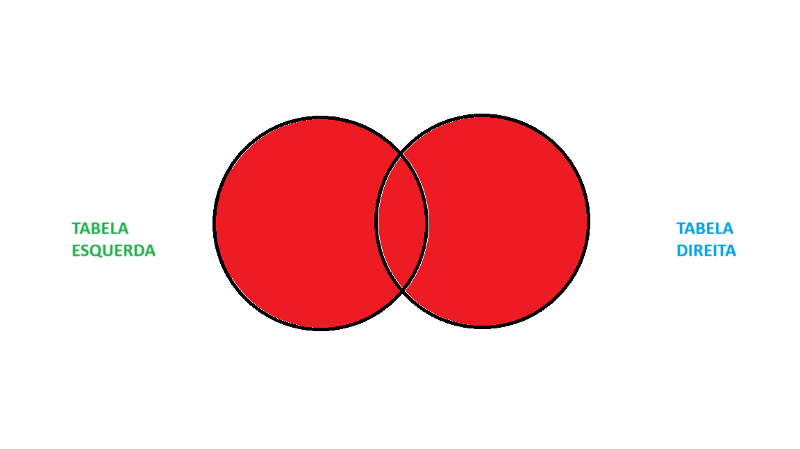

#### 2. Inner join

Retorna linhas quando houver, pelo menos, uma correspondência em ambas as tabelas.

```SQL
SELECT <nome_da_tabela_esquerda>.<nome_da_coluna>,
       <nome_da_tabela_direita>.<nome_da_coluna>
FROM <nome_da_tabela_esquerda>
INNER JOIN <nome_da_tabela_direita> 
ON <nome_da_tabela_esquerda>.<nome_da_coluna_correspondente> = <nome_da_tabela_direita>.<nome_da_coluna_correspondente>;
```

>⚠️ Geralmente esta coluna correspondente será a comparação de uma chave primária e uma chave estrangeira.

Utilizando nossos exemplos anteriores, executaríamos o comando da seguinte maneira:

```SQL
SELECT cargos.nome,
       departamentos.nome
FROM cargos
INNER JOIN departamentos
ON cargos.id_departamento = departamentos.id;
```

Como retorno, teriamos a seguinte tabela:

| nome | nome |
|---|---|
| Desenvolvedor Front-end | Desenvolvimento |
| Desenvolvedor Back-end | Desenvolvimento |
| Designer UX/UI|Design |
| Analista de Suporte | Suporte  |

Neste caso temos o título da coluna identico em ambas as tabelas, dificultando nosso leitura e análise do retorno.
Para resolver essa questão, temos um recurso chamado `Alias`, que atua como um "apelido" teporaria para o campo onde é aplicado, seja uma tabela, coluna, expressão ou, até mesmo, quando utilizamos uma função. Conseguimos fazer essa alteração através do comando `AS` seguido pela nomenclatura para essa consulta, como abaixo:

```SQL
SELECT cargos.nome AS cargo,
       departamentos.nome AS departamento
FROM cargos
INNER JOIN departamentos
ON cargos.id_departamento = departamentos.id;
```

Dessa forma, nossa tabela de retorno seria definida da seguinte maneira:

| cargo| departamento |
|---|---|
| Desenvolvedor Front-end | Desenvolvimento |
| Desenvolvedor Back-end | Desenvolvimento |
| Designer UX/UI|Design |
| Analista de Suporte | Suporte  |

Caso demandemos unir diversas tabelas para a nossa consulta, inseridos `INNER JOIN` quantas vezes forem necessárias:

```SQL
SELECT funcionarios.nome AS funcionario,
       cargos.nome AS cargo,
       departamentos.nome AS departamento
FROM funcionarios
INNER JOIN cargos
ON funcionarios.id_departamento = cargos.id;
INNER JOIN departamentos
ON cargos.id_departamento = departamentos.id;
```

Retorno desta consulta:
| funcionario | cargo| departamento |
|---|---|---|
| Maria Souza | Desenvolvedor Front-end | Desenvolvimento |
| Thalia Alves | Desenvolvedor Back-end | Desenvolvimento |
| Francisco Silva |Designer UX/UI|Design |
| Ana Franca | Analista de Suporte | Suporte  |

#### 3. Left join

Também pode ser chamado de outer left join, ou left outer join, retorna todos os dados que estão na tabela esquerda mesmo que não haja correspondência com a tabela direita (caso exista, é trazido com inner):

```SQL
SELECT <nome_da_tabela_esquerda>.<nome_da_coluna>,
       <nome_da_tabela_direita>.<nome_da_coluna>
FROM <nome_da_tabela_esquerda>
LEFT JOIN <nome_da_tabela_direita> 
ON <nome_da_tabela_esquerda>.<nome_da_coluna_correspondente> = <nome_da_tabela_direita>.<nome_da_coluna_correspondente>;
```

>⚠️ Geralmente esta coluna correspondente será a comparação de uma chave primária e uma chave estrangeira.

Utilizando nossos exemplos anteriores, executaríamos o comando da seguinte maneira:

```SQL
SELECT cargos.nome AS cargo,
       departamentos.nome AS departamento
FROM cargos
LEFT JOIN departamentos
ON cargos.id_departamento = departamentos.id;
```

| cargo | departamento |
|---|---|
| Desenvolvedor Front-end | Desenvolvimento |
| Desenvolvedor Back-end | Desenvolvimento |
| Designer UX/UI|Design |
| Analista de Suporte | Suporte  |
| Gerente de Projetos |   |

🔍 Como podemos ver acima, a consulta nos retornou todos os campos de `cargos.nome`, mesmo sem correspondência com a tabela `departamentos`, visto tal exemplo em *Gerente de Projetos*.

Também podemos obter uma consulta onde mostre somente os campos não correspondentes:

```SQL
SELECT cargos.nome AS cargo,
       departamentos.nome AS departamento
FROM cargos
LEFT JOIN departamentos
ON cargos.id_departamento = departamentos.id
WHERE cargos.id_departamento IS NULL;
```

Retorno da consulta:

| cargo | departamento |
|---|---|
| Gerente de Projetos |   |

#### 4. Right join

Também pode ser chamado de outer right join, ou right outer join, retorna todos os dados que estão na tabela direita mesmo que não haja correspondência com a tabela esquerda (caso exista, é trazido com inner):

```SQL
SELECT <nome_da_tabela_esquerda>.<nome_da_coluna>,
       <nome_da_tabela_direita>.<nome_da_coluna>
FROM <nome_da_tabela_esquerda>
RIGHT JOIN <nome_da_tabela_direita> 
ON <nome_da_tabela_esquerda>.<nome_da_coluna_correspondente> = <nome_da_tabela_direita>.<nome_da_coluna_correspondente>;
```

>⚠️ Geralmente esta coluna correspondente será a comparação de uma chave primária e uma chave estrangeira.

Utilizando nossos exemplos anteriores, executaríamos o comando da seguinte maneira:

```SQL
SELECT cargos.nome AS cargo,
       funcionarios.nome AS funcionario
FROM cargos
RIGHT JOIN funcionarios
ON funcionarios.id_cargos = cargos.id;
```

| cargo | funcionario |
|---|---|
| Designer UX/UI | Ana Pereira |
| Analista de Suporte | Carlos Souza |
| Desenvolvedor Front-end | João Silva 
| Desenvolvedor Back-end | Maria Santos |
|  | Patrícia Oliveira |

🔍 Como podemos ver acima, a consulta nos retornou todos os campos de `funcionarios.nome`, mesmo sem correspondência com a tabela `cargos`, visto tal exemplo em *Patrícia Oliveira*.

Também podemos obter uma consulta onde mostre somente os campos não correspondentes:

```SQL
SELECT cargos.nome AS cargo,
       funcionarios.nome AS funcionario
FROM cargos
RIGHT JOIN funcionarios
ON funcionarios.id_cargos = cargos.id;
WHERE funcionarios.id_cargos IS NULL;
```

Retorno da consulta:

| cargo | funcionario |
|---|---|
|  | Patrícia Oliveira |

#### 5. Full join

Também um outer, combinação de RIGHT e LEFT retornando registros de ambas as tabelas:

Utilizando nossos exemplos anteriores, executaríamos o comando da seguinte maneira:

```SQL
SELECT cargos.nome AS cargo,
       funcionarios.nome AS funcionario
FROM cargos
LEFT JOIN funcionarios
ON funcionarios.id_cargos = cargos.id
UNION
SELECT cargos.nome AS cargo,
       funcionarios.nome AS funcionario
FROM cargos
RIGHT JOIN funcionarios
ON funcionarios.id_cargos = cargos.id;
```

| cargo | funcionario |
|---|---|
| Desenvolvedor Front-end | João Silva 
| Desenvolvedor Back-end | Maria Santos |
| Designer UX/UI | Ana Pereira |
| Analista de Suporte | Carlos Souza |
| Gerente de Projetos |   |
|  | Patrícia Oliveira |

🔍 Como podemos ver acima, a consulta nos retornou todos os campos de ambas as tabelas.

>⚠️ Importante salientar que `UNION` funciona no **MySQL**. Em bancos de dados como o PostgreSQL e Oracle Database, utilizamos o `FULL JOIN`.

#### 6. Mais de um join

**INNER JOIN -** retorna somente os funcionários que possuem um cargo e um departamento associados:

```SQL
SELECT funcionarios.nome AS funcionario,
       cargos.nome AS cargo,
       departamentos.nome AS departamento
FROM funcionarios
INNER JOIN cargos
ON funcionarios.id_departamento = cargos.id;
INNER JOIN departamentos
ON cargos.id_departamento = departamentos.id;
```

Retorno desta consulta:
| funcionario | cargo| departamento |
|---|---|---|
| João Silva | Desenvolvedor Front-end | Desenvolvimento |
| Maria Santos | Desenvolvedor Back-end | Desenvolvimento |
| Ana Pereira |Designer UX/UI|Design |
| Carlos Souza | Analista de Suporte | Suporte  |

**LEFT JOIN -** retorna todos os funcionários e seus cargos (se houver), independente de terem um departamento associado ou não:

```SQL
SELECT funcionarios.nome AS funcionario,
       cargos.nome AS cargo,
       departamentos.nome AS departamento
FROM funcionarios
LEFT JOIN cargos
ON funcionarios.id_departamento = cargos.id;
LEFT JOIN departamentos
ON cargos.id_departamento = departamentos.id;
```

Retorno desta consulta:
| funcionario | cargo| departamento |
|---|---|---|
| João Silva | Desenvolvedor Front-end | Desenvolvimento |
| Maria Santos | Desenvolvedor Back-end | Desenvolvimento |
| Ana Pereira |Designer UX/UI|Design |
| Carlos Souza | Analista de Suporte | Suporte  |
| Patrícia Oliveira |  |  |

**RIGHT JOIN -** retorna todos os departamentos e as informações dos cargos correspondentes (se houver), independente de cargo estar associado a um funcionário ou não:

```SQL
SELECT funcionarios.nome AS funcionario,
       cargos.nome AS cargo,
       departamentos.nome AS departamento
FROM funcionarios
RIGHT JOIN cargos
ON funcionarios.id_departamento = cargos.id;
RIGHT JOIN departamentos
ON cargos.id_departamento = departamentos.id;
```

Retorno desta consulta:
| funcionario | cargo| departamento |
|---|---|---|
| João Silva | Desenvolvedor Front-end | Desenvolvimento |
| Maria Santos | Desenvolvedor Back-end | Desenvolvimento |
| Ana Pereira |Designer UX/UI|Design |
| Carlos Souza | Analista de Suporte | Suporte  |